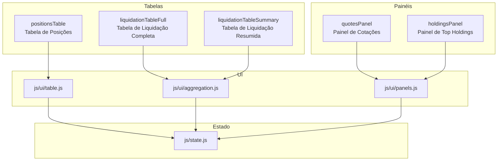

# Análise e Proposta de Nomes para Tabelas

## Resumo Executivo

Este documento apresenta uma análise completa de todas as tabelas existentes no projeto Liquidation Map Dashboard, identificando problemas de nomenclatura e propondo nomes mais coerentes e descritivos.

---

## 1. Tabelas Identificadas

### 1.1 Tabela de Posições (Principal)

| Elemento | Nome Atual | Localização |
|----------|------------|-------------|
| ID da Tabela | `positionsTable` | index.html:852 |
| ID do Tbody | `tableBody` | index.html:1027 |
| ID da Seção Wrapper | `tableSectionWrapper` | index.html:829 |
| ID da Seção Content | `tableSectionContent` | index.html:837 |
| Classe CSS | (sem classe específica) | - |

**Problemas Identificados:**
- Nome genérico `tableBody` não indica qual tabela pertence
- `tableSectionWrapper` é muito genérico
- Falta de prefixo consistente

### 1.2 Tabela de Agregação Completa

| Elemento | Nome Atual | Localização |
|----------|------------|-------------|
| ID da Tabela | `aggTable` | index.html:708 |
| ID do Tbody | `aggTableBody` | index.html:734 |
| ID da Seção Wrapper | `aggSectionWrapper` | index.html:671 |
| ID da Seção Content | `aggSectionContent` | index.html:679 |
| ID da Seção Table | `agg-table-section` | index.html:706 |
| Classe CSS | `agg-table` | index.html:38 |
| Stats Bar | `aggStatsBar` | index.html:682 |
| Inputs de Preço | `aggMinPrice`, `aggMaxPrice` | index.html:689-694 |

**Problemas Identificados:**
- Abreviação `agg` não é autoexplicativa
- Mistura de padrões: `aggTable` (camelCase) vs `agg-table-section` (kebab-case)
- Termo "Completa" não está explícito no nome

### 1.3 Tabela de Agregação Resumida

| Elemento | Nome Atual | Localização |
|----------|------------|-------------|
| ID da Tabela | `aggTableResumida` | index.html:787 |
| ID do Tbody | `aggTableBodyResumida` | index.html:813 |
| ID da Seção Wrapper | `aggSectionWrapperResumida` | index.html:750 |
| ID da Seção Content | `aggSectionContentResumida` | index.html:758 |
| ID da Seção Table | `agg-table-section-resumida` | index.html:785 |
| Classe CSS | `agg-table` | index.html:38 |
| Stats Bar | `aggStatsBarResumida` | index.html:761 |
| Inputs de Preço | `aggMinPriceResumida`, `aggMaxPriceResumida` | index.html:768-773 |

**Problemas Identificados:**
- Mistura de idiomas: `agg` (abreviação inglês) + `Resumida` (português)
- Inconsistência com a tabela "completa"
- Termo "Resumida" poderia ser mais descritivo

### 1.4 Painel de Ranking (Top Holdings)

| Elemento | Nome Atual | Localização |
|----------|------------|-------------|
| ID do Painel | `ranking-panel` | index.html:576 |
| ID da Seção Wrapper | `rankingSectionWrapper` | index.html:567 |
| ID da Seção Content | `rankingSectionContent` | index.html:575 |

**Problemas Identificados:**
- Mistura de padrões: `ranking-panel` (kebab-case) vs `rankingSectionWrapper` (camelCase)
- Título "Top Holdings" vs ID "ranking" - inconsistência semântica

### 1.5 Painel de Quotes

| Elemento | Nome Atual | Localização |
|----------|------------|-------------|
| ID do Painel | `quotes-panel` | index.html:562 |
| ID da Seção Wrapper | `quotesSectionWrapper` | index.html:553 |
| ID da Seção Content | `quotesSectionContent` | index.html:561 |

**Problemas Identificados:**
- Mistura de padrões: `quotes-panel` (kebab-case) vs `quotesSectionWrapper` (camelCase)

---

## 2. Proposta de Padronização

### 2.1 Convenção de Nomenclatura Proposta

Para garantir consistência, proponho a seguinte convenção:

| Tipo de Elemento | Padrão | Exemplo |
|------------------|--------|---------|
| IDs de elementos HTML | camelCase | `positionsTable`, `liquidationTableFull` |
| Classes CSS | kebab-case | `liquidation-table`, `positions-table` |
| Variáveis JavaScript | camelCase | `liquidationTableFull`, `positionsTable` |
| Constantes/Módulos | PascalCase ou UPPER_SNAKE | `TableState`, `TABLE_CONFIG` |

### 2.2 Tabela de Posições - Proposta

| Elemento | Nome Atual | Nome Proposto | Justificativa |
|----------|------------|---------------|---------------|
| ID da Tabela | `positionsTable` | `positionsTable` | ✅ Já adequado |
| ID do Tbody | `tableBody` | `positionsTableBody` | Adiciona contexto sobre qual tabela |
| ID da Seção Wrapper | `tableSectionWrapper` | `positionsSectionWrapper` | Consistência com o nome da tabela |
| ID da Seção Content | `tableSectionContent` | `positionsSectionContent` | Consistência com o nome da tabela |
| Classe CSS | - | `positions-table` | Para estilização específica |

### 2.3 Tabela de Agregação Completa - Proposta

| Elemento | Nome Atual | Nome Proposto | Justificativa |
|----------|------------|---------------|---------------|
| ID da Tabela | `aggTable` | `liquidationTableFull` | Nome descritivo: tabela de liquidação completa |
| ID do Tbody | `aggTableBody` | `liquidationTableFullBody` | Consistência |
| ID da Seção Wrapper | `aggSectionWrapper` | `liquidationSectionFullWrapper` | Consistência |
| ID da Seção Content | `aggSectionContent` | `liquidationSectionFullContent` | Consistência |
| ID da Seção Table | `agg-table-section` | `liquidationTableFullSection` | Padronização para camelCase |
| Classe CSS | `agg-table` | `liquidation-table` | Nome mais descritivo |
| Stats Bar | `aggStatsBar` | `liquidationStatsBarFull` | Consistência |
| Inputs | `aggMinPrice`, `aggMaxPrice` | `liquidationMinPriceFull`, `liquidationMaxPriceFull` | Consistência |

### 2.4 Tabela de Agregação Resumida - Proposta

| Elemento | Nome Atual | Nome Proposto | Justificativa |
|----------|------------|---------------|---------------|
| ID da Tabela | `aggTableResumida` | `liquidationTableSummary` | Nome em inglês, consistente |
| ID do Tbody | `aggTableBodyResumida` | `liquidationTableSummaryBody` | Consistência |
| ID da Seção Wrapper | `aggSectionWrapperResumida` | `liquidationSectionSummaryWrapper` | Consistência |
| ID da Seção Content | `aggSectionContentResumida` | `liquidationSectionSummaryContent` | Consistência |
| ID da Seção Table | `agg-table-section-resumida` | `liquidationTableSummarySection` | Padronização |
| Classe CSS | `agg-table` | `liquidation-table` | Compartilha com a tabela completa |
| Stats Bar | `aggStatsBarResumida` | `liquidationStatsBarSummary` | Consistência |
| Inputs | `aggMinPriceResumida`, `aggMaxPriceResumida` | `liquidationMinPriceSummary`, `liquidationMaxPriceSummary` | Consistência |

### 2.5 Painel de Ranking - Proposta

| Elemento | Nome Atual | Nome Proposto | Justificativa |
|----------|------------|---------------|---------------|
| ID do Painel | `ranking-panel` | `holdingsPanel` | Alinha com título "Top Holdings" |
| ID da Seção Wrapper | `rankingSectionWrapper` | `holdingsSectionWrapper` | Consistência |
| ID da Seção Content | `rankingSectionContent` | `holdingsSectionContent` | Consistência |

### 2.6 Painel de Quotes - Proposta

| Elemento | Nome Atual | Nome Proposto | Justificativa |
|----------|------------|---------------|---------------|
| ID do Painel | `quotes-panel` | `quotesPanel` | Padronização para camelCase |
| ID da Seção Wrapper | `quotesSectionWrapper` | `quotesSectionWrapper` | ✅ Já adequado |
| ID da Seção Content | `quotesSectionContent` | `quotesSectionContent` | ✅ Já adequado |

---

## 3. Resumo de Mudanças por Arquivo

### 3.1 index.html

| Linha | Nome Atual | Nome Proposto |
|-------|------------|---------------|
| 38 | `.agg-table` | `.liquidation-table` |
| 562 | `quotes-panel` | `quotesPanel` |
| 576 | `ranking-panel` | `holdingsPanel` |
| 567 | `rankingSectionWrapper` | `holdingsSectionWrapper` |
| 575 | `rankingSectionContent` | `holdingsSectionContent` |
| 671 | `aggSectionWrapper` | `liquidationSectionFullWrapper` |
| 679 | `aggSectionContent` | `liquidationSectionFullContent` |
| 682 | `aggStatsBar` | `liquidationStatsBarFull` |
| 689 | `aggMinPrice` | `liquidationMinPriceFull` |
| 694 | `aggMaxPrice` | `liquidationMaxPriceFull` |
| 706 | `agg-table-section` | `liquidationTableFullSection` |
| 708 | `aggTable` | `liquidationTableFull` |
| 734 | `aggTableBody` | `liquidationTableFullBody` |
| 750 | `aggSectionWrapperResumida` | `liquidationSectionSummaryWrapper` |
| 758 | `aggSectionContentResumida` | `liquidationSectionSummaryContent` |
| 761 | `aggStatsBarResumida` | `liquidationStatsBarSummary` |
| 768 | `aggMinPriceResumida` | `liquidationMinPriceSummary` |
| 773 | `aggMaxPriceResumida` | `liquidationMaxPriceSummary` |
| 785 | `agg-table-section-resumida` | `liquidationTableSummarySection` |
| 787 | `aggTableResumida` | `liquidationTableSummary` |
| 813 | `aggTableBodyResumida` | `liquidationTableSummaryBody` |
| 829 | `tableSectionWrapper` | `positionsSectionWrapper` |
| 837 | `tableSectionContent` | `positionsSectionContent` |
| 852 | `positionsTable` | ✅ Mantido |
| 1027 | `tableBody` | `positionsTableBody` |

### 3.2 js/ui/table.js

| Nome Atual | Nome Proposto | Tipo |
|------------|---------------|------|
| `positionsTable` | ✅ Mantido | getElementById |
| `tableBody` | `positionsTableBody` | getElementById |

### 3.3 js/ui/aggregation.js

| Nome Atual | Nome Proposto | Tipo |
|------------|---------------|------|
| `aggSectionWrapper${suffix}` | `liquidationSection${suffix}Wrapper` | Variável |
| `aggTableBody${suffix}` | `liquidationTable${suffix}Body` | Variável |
| `aggStatsBar${suffix}` | `liquidationStatsBar${suffix}` | Variável |
| `aggMinPrice${suffix}` | `liquidationMinPrice${suffix}` | Variável |
| `aggMaxPrice${suffix}` | `liquidationMaxPrice${suffix}` | Variável |
| `agg-tooltip` | `liquidationTooltip` | ID de elemento |

### 3.4 js/ui/panels.js

| Nome Atual | Nome Proposto | Tipo |
|------------|---------------|------|
| `ranking-panel` | `holdingsPanel` | getElementById |

### 3.5 js/storage/settings.js

| Nome Atual | Nome Proposto | Tipo |
|------------|---------------|------|
| `aggSectionContent` | `liquidationSectionFullContent` | getElementById |
| `aggMinPrice` | `liquidationMinPriceFull` | getElementById |
| `aggMaxPrice` | `liquidationMaxPriceFull` | getElementById |
| `aggMinPriceResumida` | `liquidationMinPriceSummary` | getElementById |
| `aggMaxPriceResumida` | `liquidationMaxPriceSummary` | getElementById |
| `colorAggBuyStrong` | `colorLiquidationBuyStrong` | getElementById |
| `colorAggBuyNormal` | `colorLiquidationBuyNormal` | getElementById |
| `colorAggSellStrong` | `colorLiquidationSellStrong` | getElementById |
| `colorAggSellNormal` | `colorLiquidationSellNormal` | getElementById |
| `colorAggHighlight` | `colorLiquidationHighlight` | getElementById |

### 3.6 js/events/init.js

| Nome Atual | Nome Proposto | Tipo |
|------------|---------------|------|
| `agg-table-section` | `liquidationTableFullSection` | getElementById |
| `agg-table-section-resumida` | `liquidationTableSummarySection` | getElementById |

### 3.7 js/events/handlers.js

| Nome Atual | Nome Proposto | Tipo |
|------------|---------------|------|
| `aggSectionContent` | `liquidationSectionFullContent` | getElementById |
| `aggSectionContentResumida` | `liquidationSectionSummaryContent` | getElementById |
| `positionsTable` | ✅ Mantido | getElementById |

### 3.8 css/components/tables.css

| Nome Atual | Nome Proposto | Tipo |
|------------|---------------|------|
| `.agg-table` | `.liquidation-table` | Seletor CSS |

---

## 4. Variáveis de Estado Relacionadas

### 4.1 js/state.js - Funções Getter/Setter

| Nome Atual | Nome Proposto | Tipo |
|------------|---------------|------|
| `getAggInterval()` | `getLiquidationInterval()` | Função |
| `setAggInterval()` | `setLiquidationInterval()` | Função |
| `getAggVolumeUnit()` | `getLiquidationVolumeUnit()` | Função |
| `setAggVolumeUnit()` | `setLiquidationVolumeUnit()` | Função |
| `getAggVolumeUnitResumida()` | `getLiquidationVolumeUnitSummary()` | Função |
| `setAggVolumeUnitResumida()` | `setLiquidationVolumeUnitSummary()` | Função |
| `getShowAggSymbols()` | `getShowLiquidationSymbols()` | Função |
| `setShowAggSymbols()` | `setShowLiquidationSymbols()` | Função |
| `getAggZoneColors()` | `getLiquidationZoneColors()` | Função |
| `setAggZoneColors()` | `setLiquidationZoneColors()` | Função |
| `getAggHighlightColor()` | `getLiquidationHighlightColor()` | Função |
| `setAggHighlightColor()` | `setLiquidationHighlightColor()` | Função |
| `getAggMinPrice()` | `getLiquidationMinPriceFull()` | Função |
| `setAggMinPrice()` | `setLiquidationMinPriceFull()` | Função |
| `getAggMaxPrice()` | `getLiquidationMaxPriceFull()` | Função |
| `setAggMaxPrice()` | `setLiquidationMaxPriceFull()` | Função |
| `getAggMinPriceResumida()` | `getLiquidationMinPriceSummary()` | Função |
| `setAggMinPriceResumida()` | `setLiquidationMinPriceSummary()` | Função |
| `getAggMaxPriceResumida()` | `getLiquidationMaxPriceSummary()` | Função |
| `setAggMaxPriceResumida()` | `setLiquidationMaxPriceSummary()` | Função |
| `getAggTableHeight()` | `getLiquidationTableHeight()` | Função |
| `setAggTableHeight()` | `setLiquidationTableHeight()` | Função |

---

## 5. Diagrama de Relacionamentos

---

## 6. Impacto da Mudança

### 6.1 Benefícios

1. **Clareza**: Nomes autoexplicativos que indicam a função de cada elemento
2. **Consistência**: Padronização de convenções (camelCase para IDs, kebab-case para classes)
3. **Manutenibilidade**: Facilita a localização e modificação de elementos
4. **Internacionalização**: Remove mistura de idiomas (português/inglês)
5. **Escalabilidade**: Estrutura preparada para adição de novas tabelas

### 6.2 Riscos

1. **Quebra de referências**: Todos os arquivos que referenciam os IDs antigos precisam ser atualizados
2. **Testes**: Necessidade de testar todas as funcionalidades após a mudança
3. **CSS**: Estilos podem quebrar se não atualizados corretamente
4. **Persistência**: Dados salvos com chaves antigas podem precisar de migração

### 6.3 Recomendações de Implementação

1. Fazer as mudanças em etapas, uma tabela por vez
2. Usar busca e substituição global com cuidado
3. Testar cada etapa antes de prosseguir
4. Manter backup do código original
5. Considerar usar aliases temporários durante a transição

---

## 7. Próximos Passos

1. [ ] Revisar e aprovar a proposta de nomenclatura
2. [ ] Criar branch para as alterações
3. [ ] Implementar mudanças no index.html
4. [ ] Atualizar referências nos arquivos JavaScript
5. [ ] Atualizar seletores CSS
6. [ ] Atualizar funções de estado em state.js
7. [ ] Testar todas as funcionalidades
8. [ ] Documentar as mudanças no CHANGELOG

---

## 8. Contagem de Alterações

| Arquivo | Alterações Estimadas |
|---------|---------------------|
| index.html | ~25 alterações |
| js/ui/table.js | ~2 alterações |
| js/ui/aggregation.js | ~15 alterações |
| js/ui/panels.js | ~4 alterações |
| js/storage/settings.js | ~15 alterações |
| js/events/init.js | ~2 alterações |
| js/events/handlers.js | ~3 alterações |
| js/state.js | ~20 alterações |
| css/components/tables.css | ~1 alteração |
| **Total** | **~87 alterações** |
